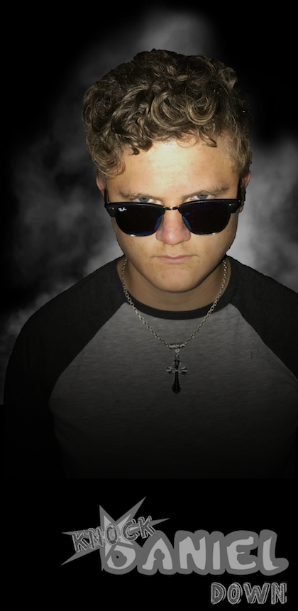
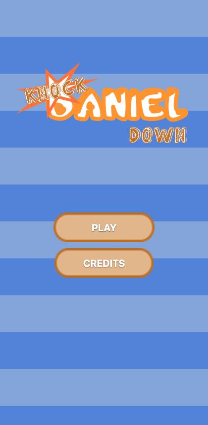
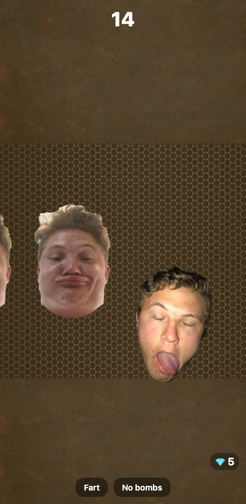
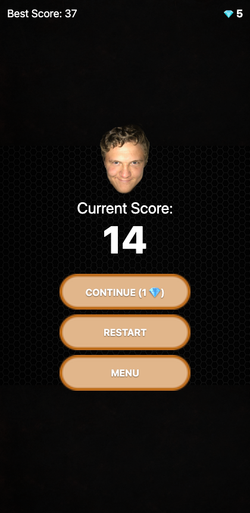
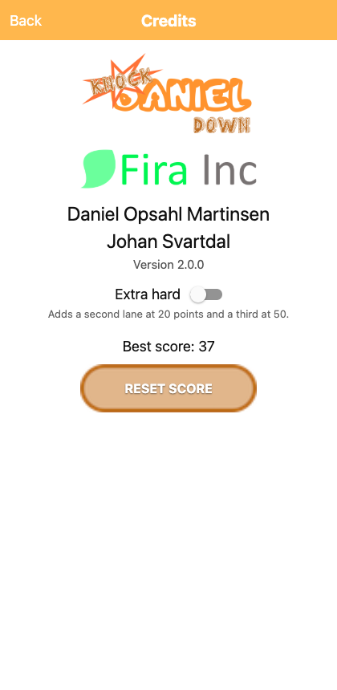

# Knock Daniel Down

A small arcade game about tapping faces before they slide off the screen. Originally a 2017 Android app written in Java; rebuilt with React Native and Expo so it now runs on **iOS, Android and the web** from one codebase.

<p align="center">
  
  
  
  
  
</p>

## Getting started

You need [Node.js](https://nodejs.org/) 20 or newer. Nothing else — no Android SDK, no Xcode, no database, no backend.

```bash
npm install
npm start
```

That's it. `npm start` prints a menu: press <kbd>w</kbd> to open it in your browser, <kbd>a</kbd> for an Android emulator, or <kbd>i</kbd> for the iOS simulator. Scanning the QR code with [Expo Go](https://expo.dev/go) runs it on a real phone.

To skip the menu and go straight to one platform:

```bash
npm run web      # browser
npm run ios      # iOS simulator (macOS + Xcode)
npm run android  # Android emulator or attached device
```

The browser target needs no native tooling at all, so `npm run web` is the fastest way to see it working.

## How to play

Faces slide in from the left. Tap one before it leaves the right edge — if any face escapes, the run is over.

| Thing | What it does |
| --- | --- |
| Ordinary face | 1 point |
| Golden face | 5 points |
| Diamond face | 1 point and 1, 2 or 3 diamonds. Far rarer than golden, and the only way to earn diamonds. You will see it coming — it trails light. |
| Mexican face | 15 points, and a burst of cacti. Only appears once you have bought the head. |
| Mexican face | 15 points, and a burst of cacti. Only appears once you have bought the head. |
| Bomb | Never tap it. Tapping one ends the run. Bombs only start appearing after 15 points. |

Both the spawn rate and the crossing speed tighten slightly with every face you knock down, so runs get faster the longer you last.

A face you hit is knocked up out of its lane and tumbles off the bottom of the screen, and the knock-down sound changes from hit to hit.

**Diamonds** are earned by knocking down diamond faces, and spent in the store between runs:

- **Fart** (1 diamond) — clears faces automatically at mid-screen for 10 seconds.
- **No bombs** (1 diamond) — stops bombs spawning for 10 seconds.
- **Daniels** — extra heads to knock down. Classic, golden and diamond are yours from the start; **Mexican Daniel** costs 50 diamonds, is worth 15 points, and bursts with cacti.

Power-ups are stock: buy them in the store, then spend them in a run. You cannot shop once a run has started. **Continue** is the exception — it revives you after a loss and keeps your score, costing 1 diamond the first time and one more each time you use it in the same run.

Faces start out crossing the middle of the screen. A **second lane** opens at 20 points and a **third** at 50, so you end up watching the whole screen at once. Your best score and diamond balance are saved between sessions.

## No payments, no tracking

The 2017 version sold diamonds through Google Play billing. All of that is gone: the store screen, the billing library, the `com.android.vending.BILLING` permission, and the Play licensing key. Diamonds are now earned by playing.

The game contains no analytics, no crash reporting, no advertising, and no third-party SDKs of any kind. It makes no network requests of its own, and every piece of saved state (best score, diamonds, your power-ups, unlocked heads, the audio toggles) lives only on your device — `localStorage` on the web, and the platform key-value store on iOS and Android. There is nothing to opt out of.

## Project layout

```
App.tsx                  screen switching and the phone-shaped web frame
src/
  components/
    Face.tsx             one face or bomb crossing the screen
    GoldenRings.tsx      the rings thrown out by a golden face
    LightRays.tsx        the halo behind a diamond face
    ParticleBurst.tsx    diamonds or cacti thrown from a hit
    Panel.tsx            a titled card, shared by settings and credits
    PillButton.tsx       the game's button, using the original artwork
    ScreenHeader.tsx     the back bar on the menu sub-screens
  game/
    audio.ts             sound effects and the two music loops
    constants.ts         every tuning value for a run
    faces.ts             the head catalogue
    images.ts            all artwork, in one place
    storage.ts           saved state
    types.ts             shared types
  screens/
    LoadingScreen.tsx    splash sequence
    MenuScreen.tsx       main menu
    GameScreen.tsx       the game itself
    StoreScreen.tsx      spending diamonds on power-ups and heads
    SettingsScreen.tsx   audio, saved progress, credits
assets/                  the original 2017 artwork and sounds
docs/screenshots/        the images above
```

If you want to change how the game feels, `src/game/constants.ts` is almost certainly the only file you need.

## How it works

Two decisions explain most of the code.

**Movement is described, not measured.** Every face crosses the screen linearly, so where it is at any moment follows from when it started and how long its crossing takes. Nothing ever reads a position back out of the animation. That lets the visual movement run on the native driver while the rules — misses, mid-screen auto-kills — are worked out in plain arithmetic on a 50 ms timer.

**The run lives in refs, not state.** The spawn timer and the rules tick both read and write the run many times a second, and routing that through React state would mean acting on stale values. `GameScreen` keeps the run in a ref and calls a `repaint` reducer whenever something changes that the player should see.

There is no navigation library. With five screens and no deep linking, `App.tsx` just tracks which one is current, which also keeps the web build free of routing configuration.

## Contributing

See [CONTRIBUTING.md](CONTRIBUTING.md).

## Credits

Made by Daniel Opsahl Martinsen and Johan Svartdal, originally released in 2017.

## A note on the artwork

The faces, splash art and icon are photographs of Daniel Opsahl Martinsen, one of the two authors, used with his involvement in the original project. They are the game — it does not really work without them.

Publishing this repository makes those photographs publicly downloadable and, under the licence below, redistributable and modifiable by anyone. That is a fine outcome if everyone pictured is happy with it, and worth confirming before you push, because it is not easily undone afterwards. If you would rather keep the code public and the likeness private, replace the files in `assets/images/` — nothing outside `src/game/images.ts` refers to them by name.

## Licence

[MIT](LICENSE) for the source code.

The artwork and sound effects in `assets/` are **not** covered by the MIT licence. They are personal photographs and recordings, included so the game runs as it originally did; all rights to them are reserved by their authors. If you fork this to build something of your own, replace them.
